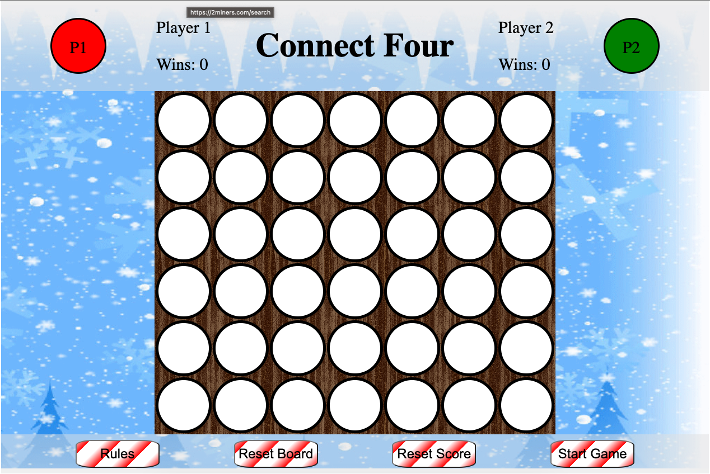
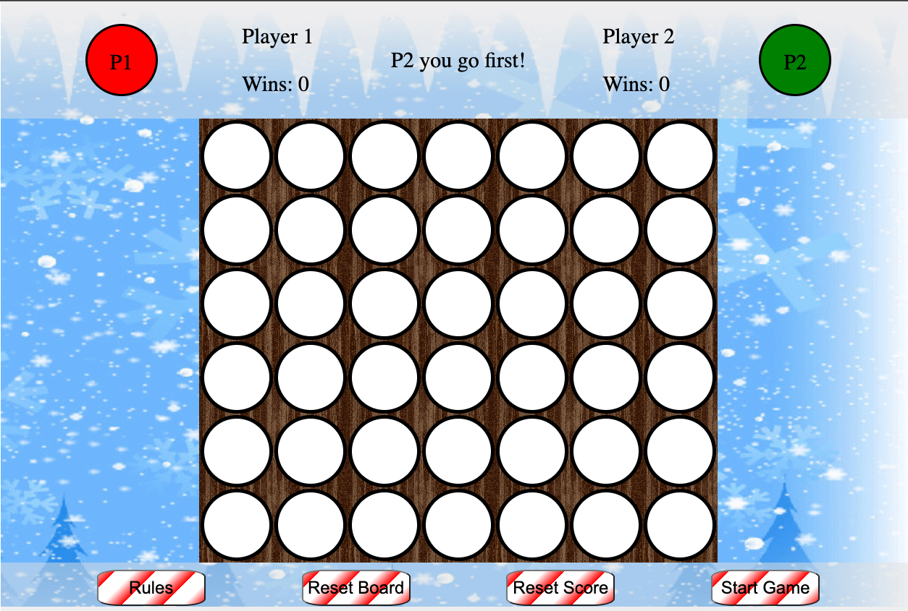
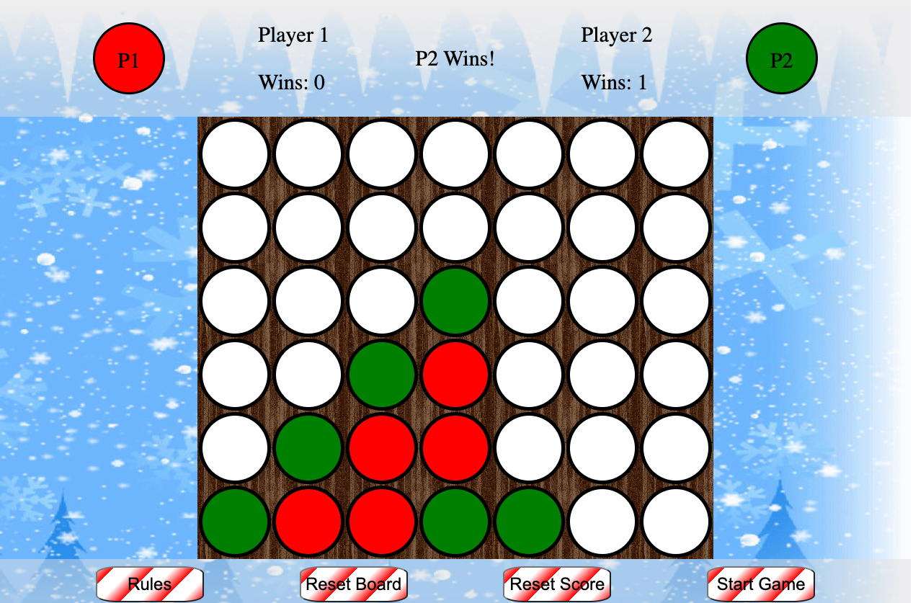
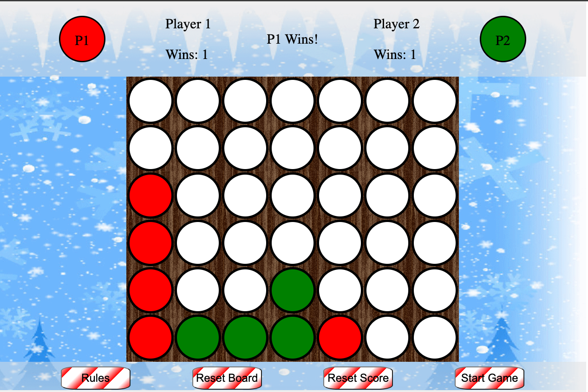
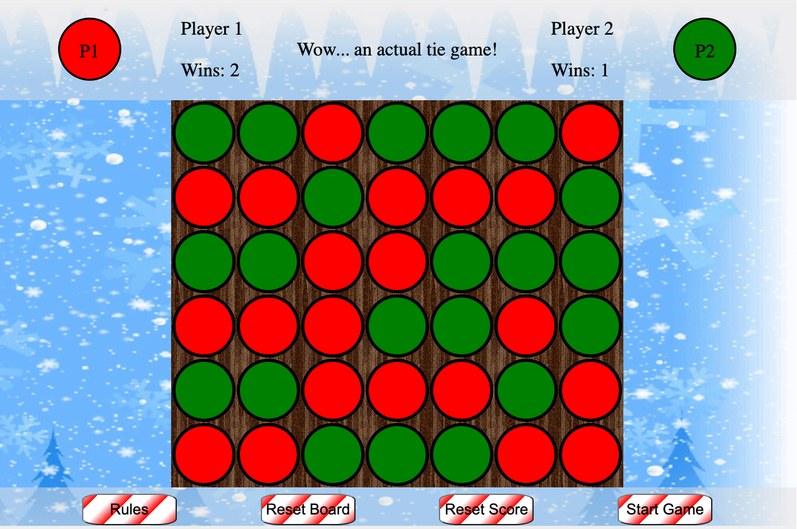

# GA Project 1: Connect Four

### To Play <a href="https://rcarr94.github.io/ga-project-1/" target="_blank">click here</a>

### General Overview

I decided to make Connect Four for my first project at General Assembly since it had similarities to what we recently learned about when making tic-tac-toe. The JS was fun to work through and to figure out how develop its win logic to clearly indicate when a player has one. The other challenging part to this game was figuring out how to make each chip drop to the lowest available row in each column. With it being the winter holiday time of year, I was inspired to create a winter/holiday themed game consisting of a snowy gif background and candy cane coloured buttons!

### How to Play

Two players are required. Player 1 will be assigned the red chips and Player 2, the green. Players will take turns dropping one chip per turn into their desired column. When selected, the chip will fall to the lowest row that is currently not occupied by a chip.

The first player to align four of their coloured chips in a line vertically, horizontally, or diagonally, wins the game! To begin playing - press the 'Start Game' button to see who gets to play the first chip!

Above the board, messages will appear indicating whos turn it is, if a player has won or tied, or instructions on how to play again. Adjacent to these messages, are each players title with their chip colour and win tracker.

Below the board, there are 4 buttons:

- Rules: when clicked, players will be directed to a web page that provides detailed instructions on how to pay through a new tab.
- Reset Board: The current board will reset so that no chips are in play. This button can be pressed at anytime. Wins will not be reset.
- Reset Score: Only available to select when no chips are in play. This button will reset the current number of wins for each player.
- Start Game: Only available to select when no chips are in play. This button will randomly select who will go first.

### Screenshots

Main screen 

Start message 

Green win 

Red win 

Tie Screen<rb>

### Technologies Used

- HTML
- CSS
- JavaScript

### Icebox Item

- Customizable names so that each player can have a more personalized experience
- Add interactive sounds for when players drop a chip into the board, win the game, reset the board, etc.
- Make fully responsive so that the game can be comfortably played on any phone or tablet in addition to the regular browser
