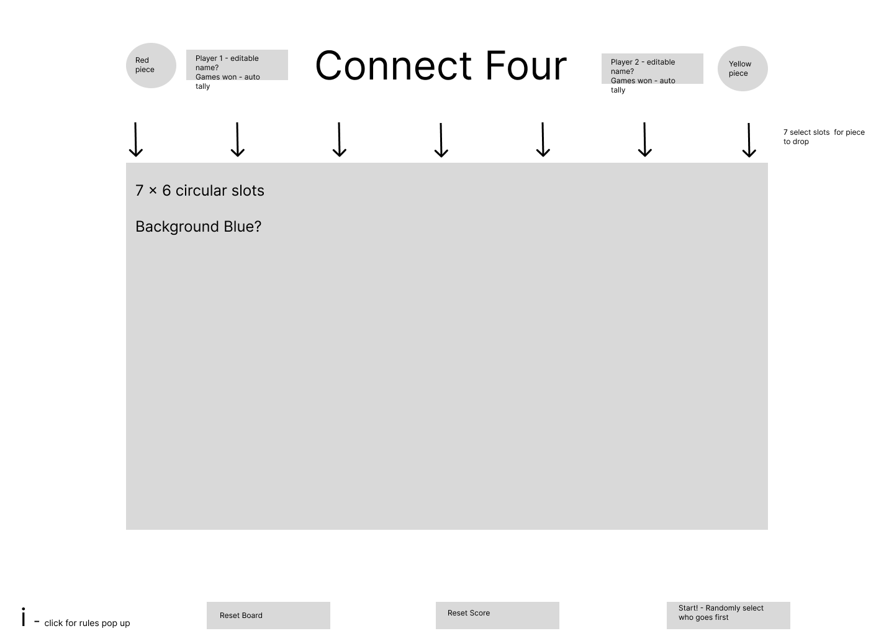

# Connect Four - Pseudocode

### Wireframe of Main Game View

 

### Player 1 & 2 Tabs
- Change name button, when clicked, user can input their own name, letters permitted only. Corresponding code will need to be called upon dynamically
- Each players score(# of wins) will be displayed below their name.
- If player 1 wins, p1Score = p1Score + 1 (same for P2)

 

### 'i' icon - instructions for the game
 - when the 'i' is clicked, a pop-up message will appear providing game instructions
 - 'x' out option to hide message

  

 ### 'Reset Board' Button
 - When this button is clicked, the current status of the board is reset back to its original state - no pieces in play.
 - Does not impact the current score.

  

 ### 'Reset Score' Button
 - When this button is clicked, the current score for each player will be reset to 0.
 - Button is not active when game pieces are currently in play.

  

 ### 'Start!' Button
 - When clicked, player 1 or player 2 will randomly be selected to take the first turn of the game.
 - Button will be disabled after initial click until both 'Reset Board' & 'Reset Score' are clicked.

  

 ### Arrow Selectors above game board
 - When column arrow is clicked, corresponding game piece will be 'dropped' into the specified column
 - if the selected column is full, column will not be available to select.

  

 ### Connect Four Game Board
 - Board will consist of 7 columns & 6 rows
 - Grid set up
 - Will listen for which column is selected
 - If coordinates X,Y have an existing piece in place, Y + 1 (try the space above, repeat until empty space is found).
 - Else, place game piece in X,Y space
 - If player 1's turn - game piece color = RED
 - Else - game piece color = YELLOW (or Green for holiday theme)

  
 
 ### Game Winning Conditions
 - If 4 red pieces are in line horizontally, vertically, or diagonally, display message "Player 1 wins, they connected four! - Reset the board!" and update P1 score
 - Repeat for P2 pieces
 - If there are no more moves available and no sequences of 4, display message "It's a Draw - reset the board!"
 